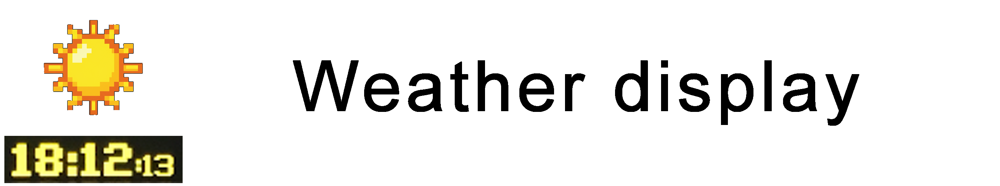

**A real-time, miniature weather display based upon a Raspberry Pi / Zero and 256x64 SPI OLED display. Uses the publicly available [OpenWeatherMap One Call API](https://openweathermap.org/api/one-call-api). This project was MASSIVELY inspired by [chrisys](https://github.com/chrisys)'s [Train Departure Display](https://github.com/chrisys/train-departure-display) project **

## Highlights

- **See local weather**: Display the current weather and forecast for your location. And on your commute.
- **Highly configurable**: Customize many aspects of the display including which weather attributes you want to see.
- **Two locations**: Specify two locations - useful for commuters!
- **Clear notification for rain**: If rain is forecast in the next 12h, the display shows an umbrella icon for your convenience.

## How to build

**Check out [the documentation](/docs/01-getting-started.md) for full hardware/software requirements and the complete build guide.**

- [Getting Started](/docs/01-getting-started.md)
- [Connecting the display to the Pi](/docs/02-connecting-the-display-to-the-pi.md)
- [Configuration](/docs/03-configuration.md)

## Credits

This project is a fork of the excellent [Train Departure Display by chrisys](https://github.com/chrisys/train-departure-display). A big thanks to him and the original contributors for creating the foundation that this project is built upon.

The fonts used were painstakingly put together by `DanielHartUK` (and modified by me to include the 'degree' symbol) and can be found on GitHub at https://github.com/DanielHartUK/Dot-Matrix-Typeface - A huge thanks for making that resource available!